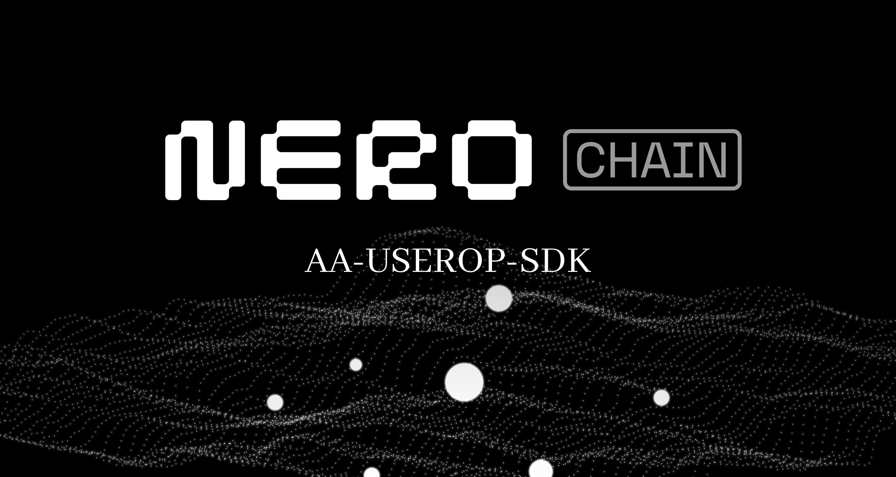

# Getting started

A simple JS library for building ERC-4337 UserOperations.

# Usage

See the `userop` documentation at [docs.nerochain.io](https://docs.nerochain.io/en/aa/userOpSdkUsage).

# Contributing

## Prerequisites

- Node 16 or later

## Setup

Install dependencies:

```bash
yarn install
```

Run tests:

```bash
yarn test
```

# License

Distributed under the MIT License.

# Contact

Feel free to direct any technical related questions to the `dev-hub` channel in the [Nero Discord](https://discord.gg/nerochainofficial).
